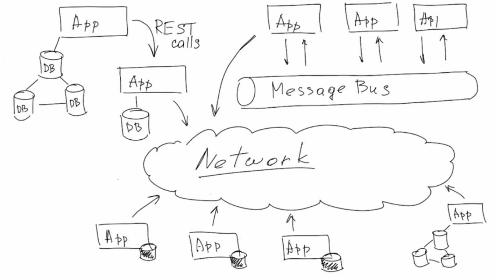
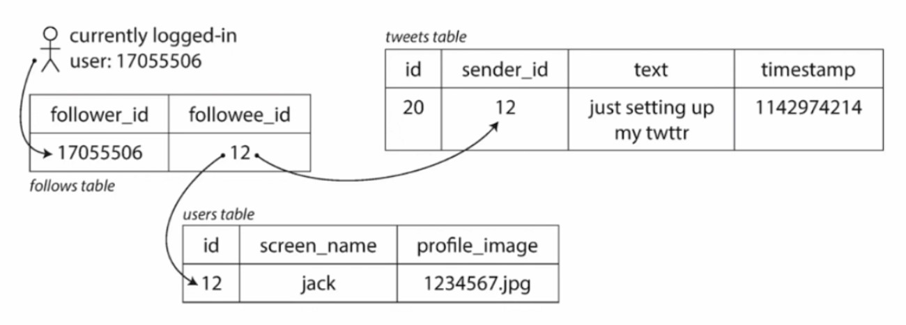
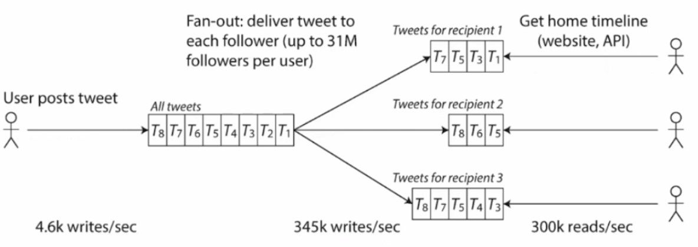
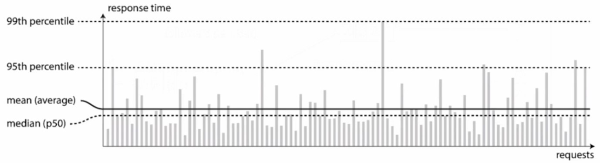
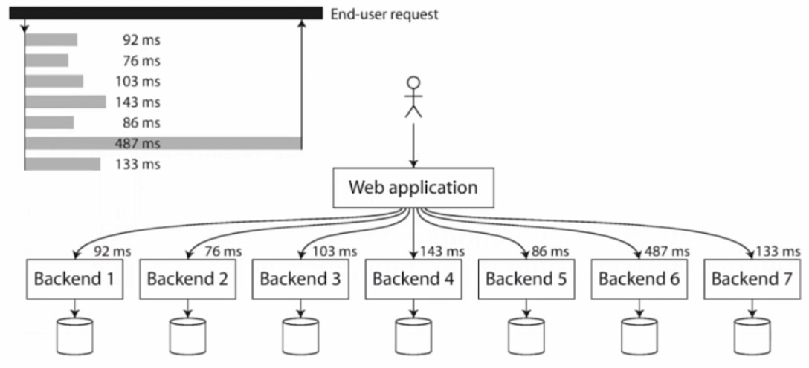

# Lecture 1

## Architecture, Requirements

### Software architecture
- high-level structure, which consists of constituent parts and the dependencies between those parts
- set of structures needed to reason about the system, which comprise software elements, relations among them, and properties of both.

***Documenting Software Architectures by Bass et al.***

***Software design*** - the process of defining architecture (according to the given and obtained system requirements)

### System requirements
- Functional
- Non-functional (.*ability)
    - Reliability
    - Performance
    - Scalability
    - Maintainability

### Reliability

Application is continuing to work correctly, even when things go wrong
- performs the function that the user expected, can tolerate the user making mistakes
- performance is good enough for the required use case, under the expected load and data volume

***Fault*** - one component of the system deviating from its spec

***Failure*** - system (as a whole) stops providing the required service to the use

***The Systems we design should be fault-tolerant or resilient***

### Scalability

Even if a system is working reliably today, that doesn't mean it will necessarily work reliably in the future...
- One common reason for degradation is increased load. Scalability is the term we use to describe a system's ability to deal with increased load
- Figure out and describe the key load parameters on your app, explore your system's use cases and system operations
- How much do you need to increase the resources if you want to keep performance unchanged

### Maintainability

- Monitoring the health of the system and quickly restoring service if it goes into a bad state
- Tracking down the cause of problems, such as system failures or degraded performance
- Keeping software and platforms up to date, including security patches
- Keeping tabs on how different systems affect each other, so that a problematic change can be avoided before it causes damage
- Anticipating future problems and solving them before they occur
- Preserving the organization's knowledge about the system, even as individual people come and go

