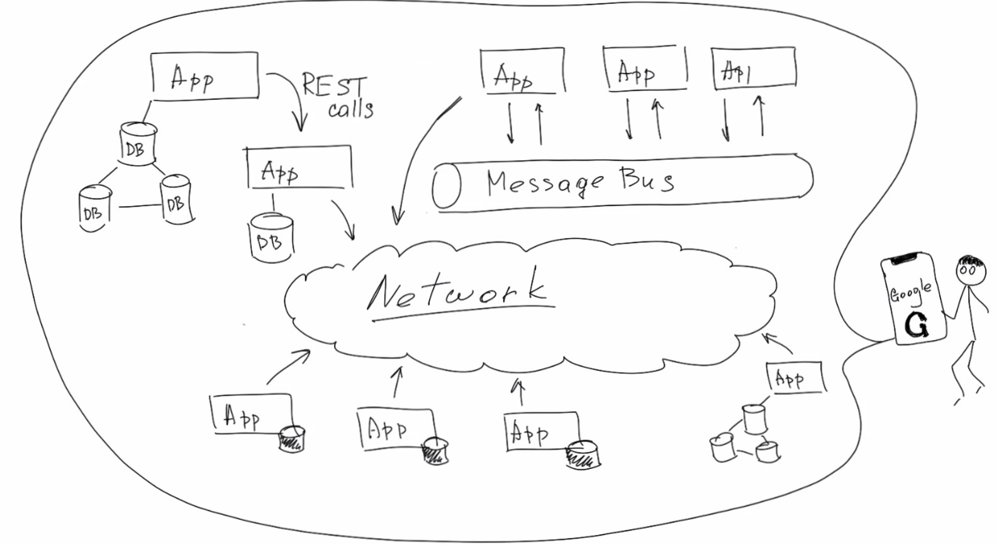
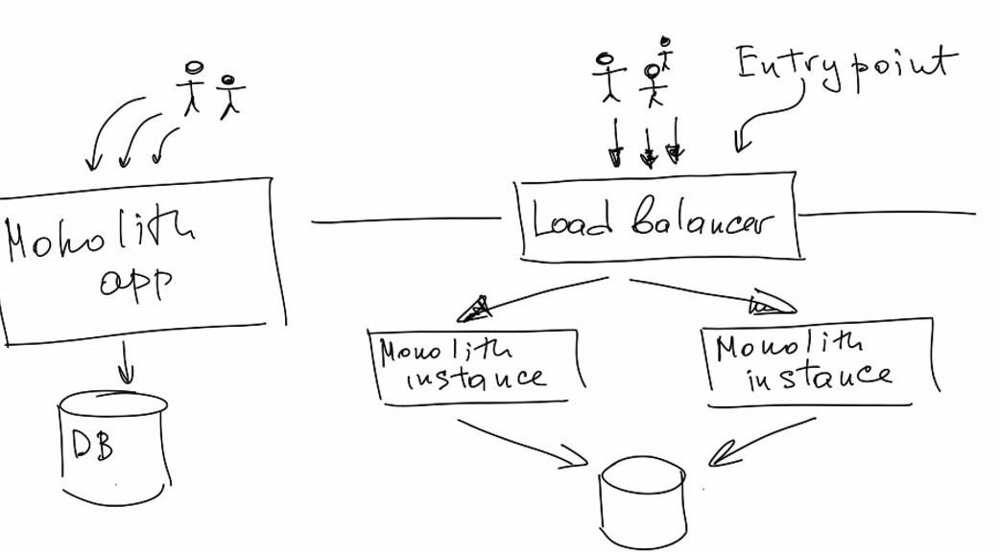
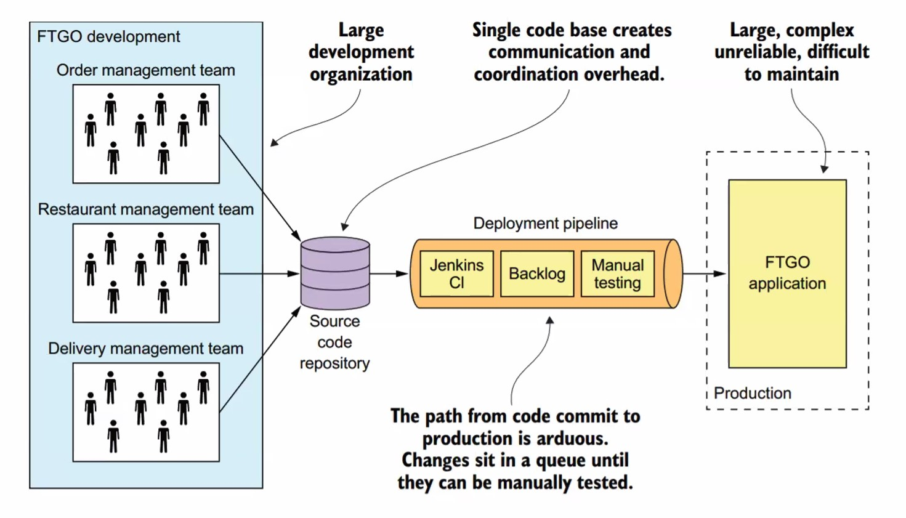
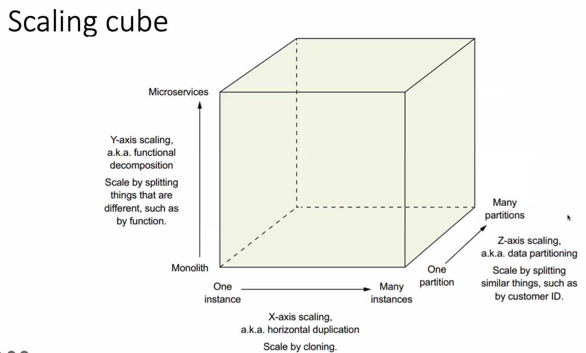
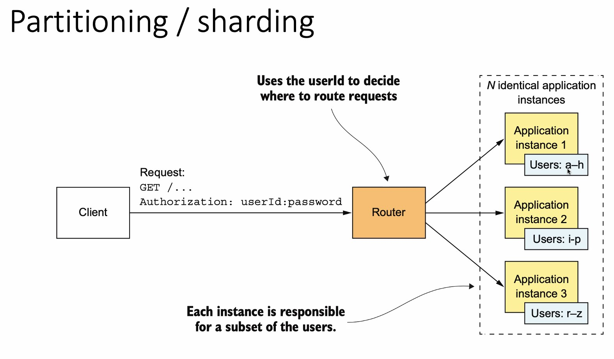
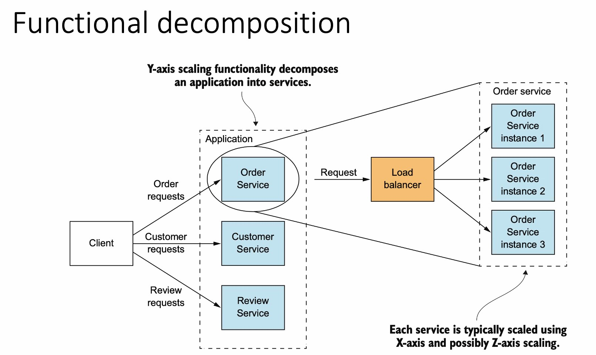
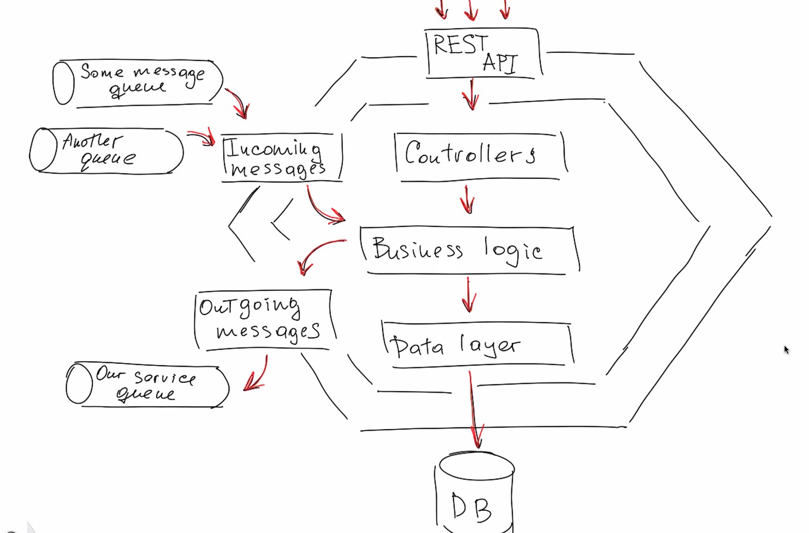
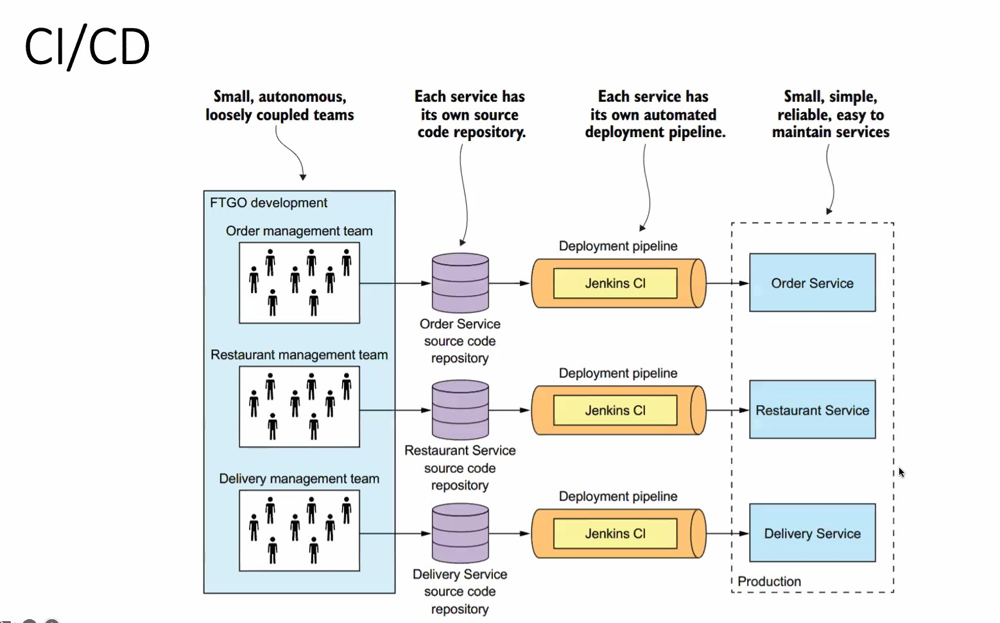

# Lecture 2

## Architectural Styles

### Benefits of the monolithic architecture 
- Simple to develop 
- Easy to make radical changes to the application 
- Straightforward to test 
- Straightforward to deploy 
- Easy to scale

### Drawbacks of the monolithic architecture

### Microservice architecture 
- architectural style that functionally decomposes ап application into а 
set of services. 
    - Note that this definition doesn't say anything about size. lnstead, what 
        matters is that each service is focused оп something specific. 
- structure the application as а collection of loosely coupled, 
independently deployable services 

### Microservices as a form of modularity 
- modules that are developed and understood by different people 
- defined using a combination of programming language constructs 
(such as Java packages) and build artifacts (such as Java JAR files) 
- has an API, which is an impermeable boundary that is difficult to 
violate 
- loosely coupled and communicate only via APIs 
- having its own datastore 

### Benefits of the microservice architecture 
- It enables the continuous delivery and deployment of large, complex 
applications. 
- Services are small and easily maintained. 
- Services are independently deployable. 
- Services are independently scalable. 
- The microservice architecture enables teams to be autonomous. 
- It allows easy experimenting and adoption of new technologies. 
- It has better fault isolation. 

### Drawbacks of the microservice architecture
- Finding the right services is challenging 
- Inter-process communication implementation 
- Creating and maintaining microservice-specific infrastructure 
(discovery, tracing, logs aggregation etc.) 
- Automating service creating-deploying processes, codebase patterns, 
approaches and development processes unification 
- Consistency guarantee questions 
- Query implementation questions 
- API evolving and making breaking changes 

