# Lecture 3

## EDA | DDD | Event Sourcing

### Event Sourcing

### Events

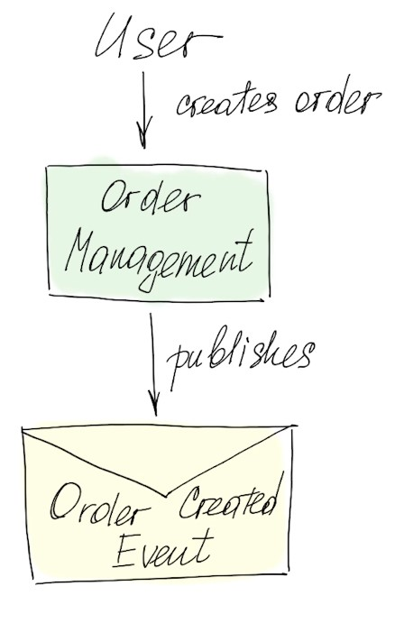
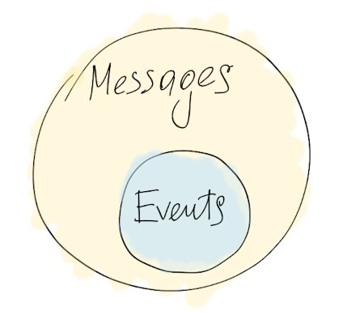

### Event Driven Architecture EDA

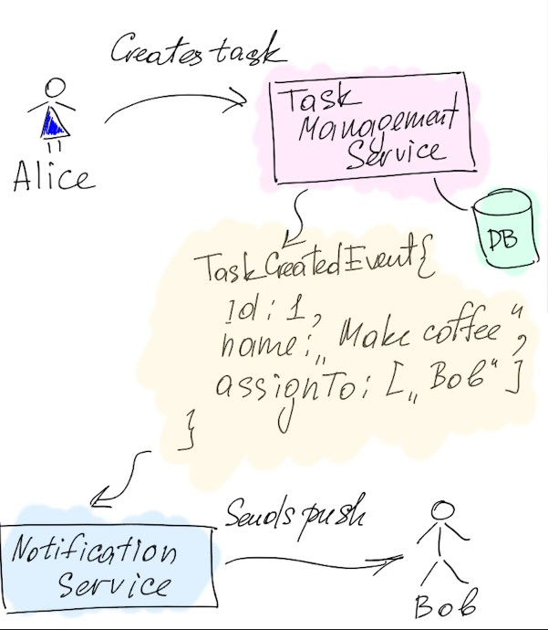

### Synchronous vs Asynchronous

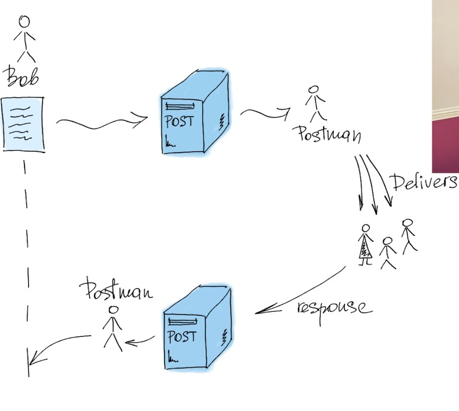

### C чем можно сравнивать EDA (Event Driven Architecture)

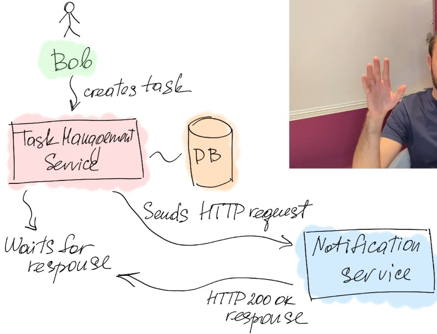

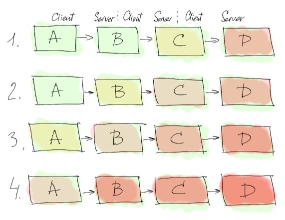

***Reliability*** — system continues to work correctly (performing the 
correct function at the desired level of performance) even if 
some of its components are working wrong (or even 
unavailable). 

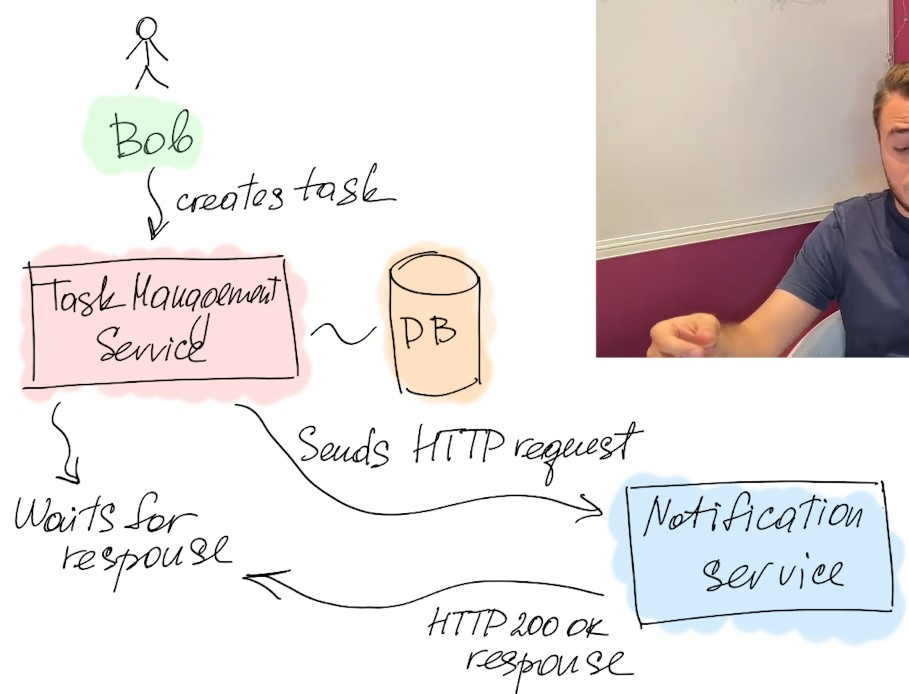

### Особенности и преимущества EDA - Изменение направленности коммуникации

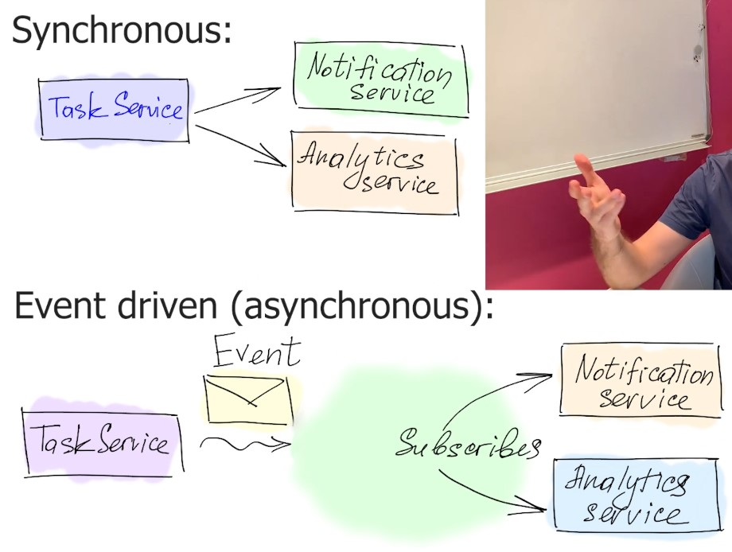

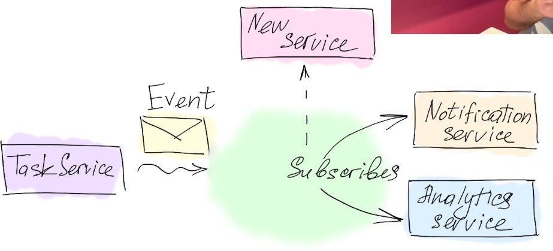

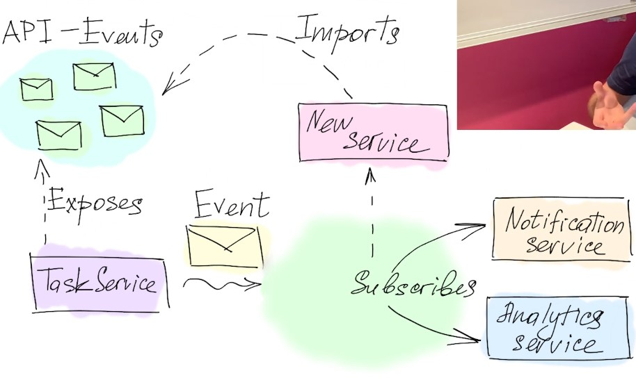

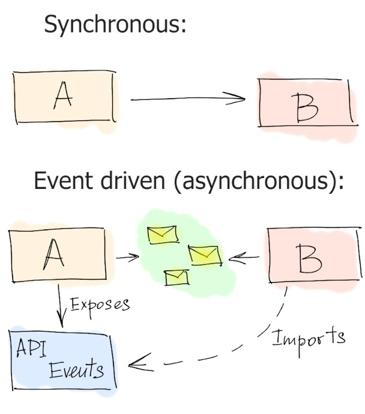

### Особенности и преимущества EDA - надежность cbcntvs. Message brokers

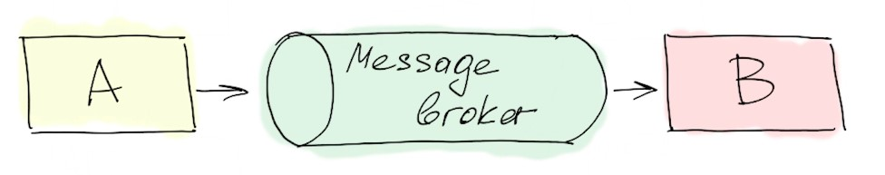

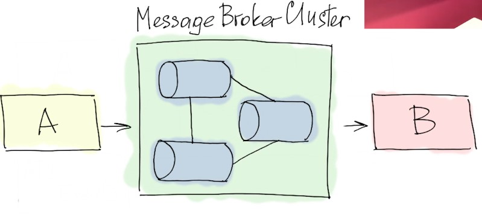

### Особенности и преимущества EDA - разделение записи и чтения. CQRS

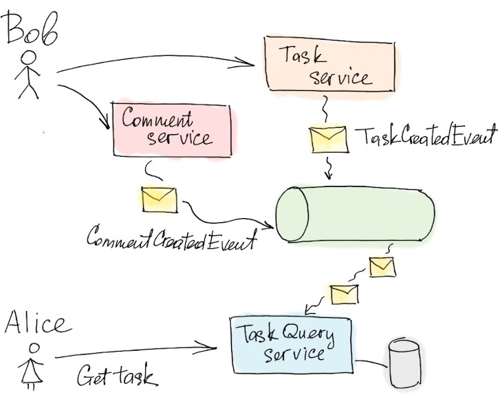

### Domain Driven Design

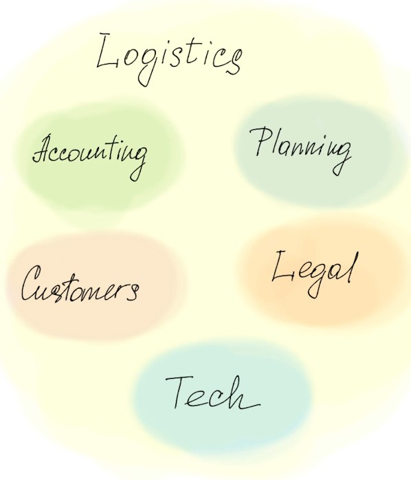

### DDD - Повсеместный язык. Ubiquitous language

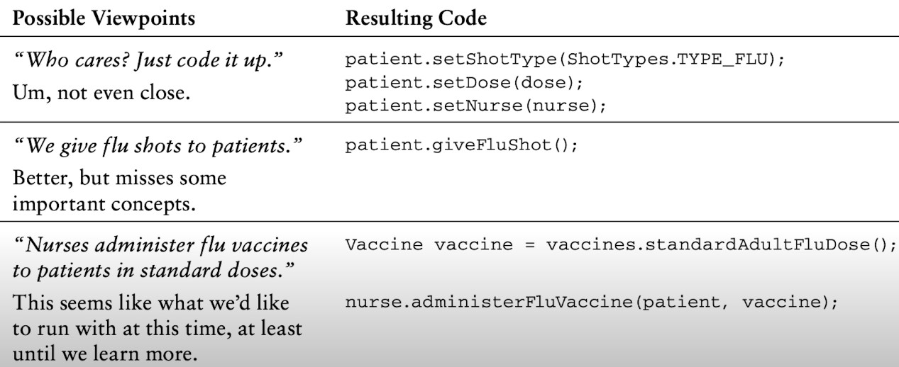

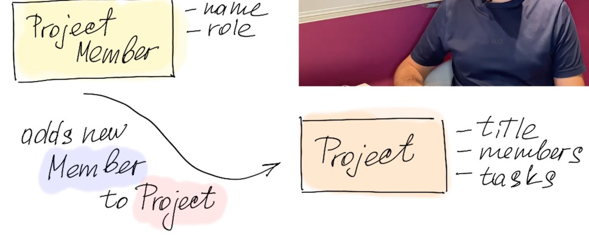

### DDD - Ограниченный контекст. Bounded context

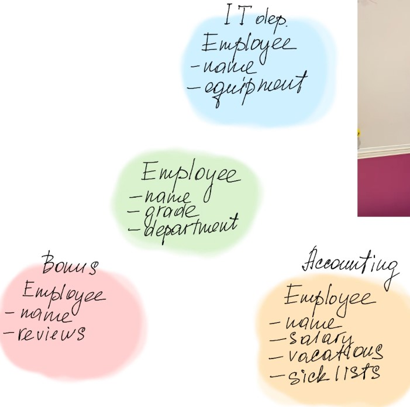