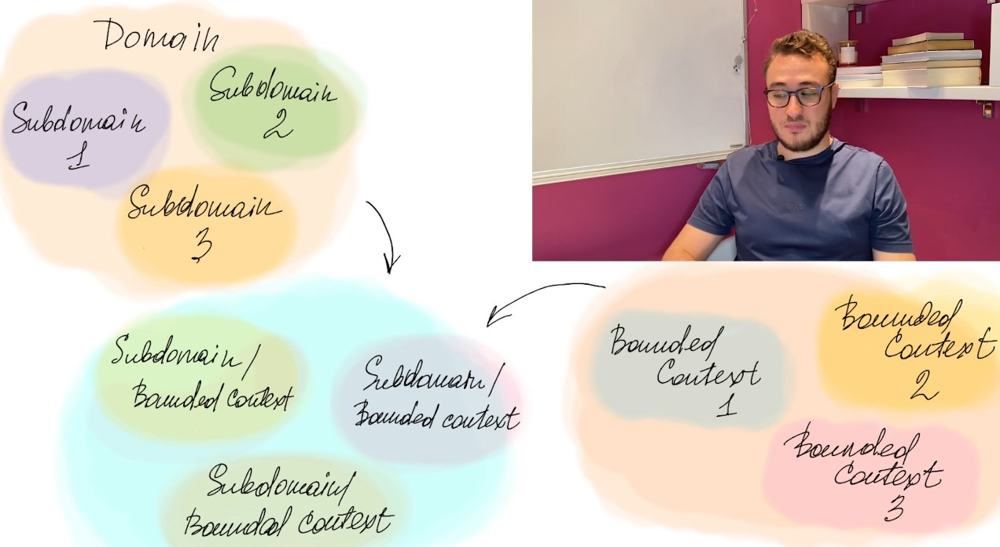
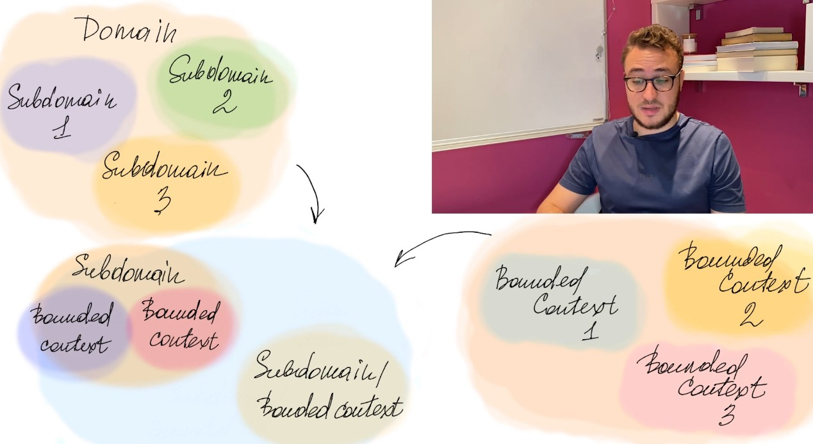
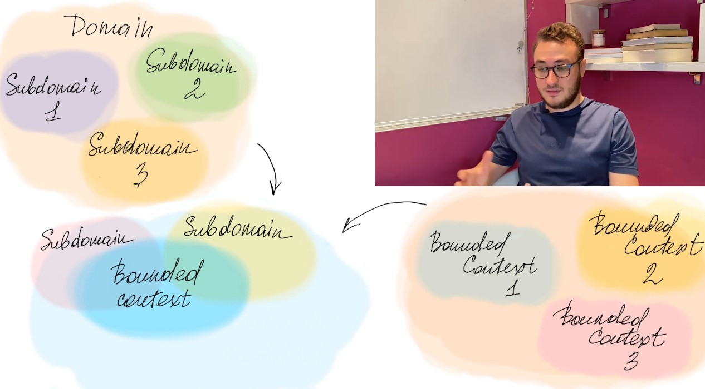

# Lecture 3

## EDA | DDD | Event Sourcing

### Event Sourcing

- Instead of storing just the current state of the data in a domain, use an append-only store to record the full series of actions taken on that data. The store acts as the system of record and can be used to materialize the domain objects.
- This can simplify tasks in complex domains, by avoiding the need to synchronize the data model and the business domain, while improving performance, scalability, and responsiveness.
- It can also provide consistency for transactional data, and maintain full audit trails and history that can enable compensating actions.

### Events

- Application code sends a series of events that imperatively describe each action that has occurred on the data to the event store, where they're persisted. Each event represents a set of changes to the data (such as AddedItemToOrder).

### Event Driven Architecture EDA

- An event-driven architecture consists of ***event producers*** that generate a stream of events, and ***event consumers*** that listen for the events.
- Events are delivered in near real time, so consumers can respond immediately to events as they occur.
- Producers are decoupled from consumers — a producer doesn't know which consumers are listening.
- Consumers are also decoupled from each other, and every consumer sees all of the events.

### Synchronous vs Asynchronous

- Synchronous: The producer waits for the consumer to acknowledge receipt of the event before continuing.
- Asynchronous: The producer doesn't wait for the consumer to acknowledge receipt of the event before continuing.

### C чем можно сравнивать EDA (Event Driven Architecture)

- Event-driven architecture is similar to the publish-subscribe pattern.

***Reliability*** — system continues to work correctly (performing the 
correct function at the desired level of performance) even if 
some of its components are working wrong (or even 
unavailable). 

### Особенности и преимущества EDA - Изменение направленности коммуникации

### Особенности и преимущества EDA - надежность cbcntvs. Message brokers

- We don't wait for a reply (Reliability)
- Provided communication between services that may not be running at the same time.
- Improved system performance by introducing asynchronous processing.
- Increased reliability by guaranteeing the transmission of messages.

### Особенности и преимущества EDA - разделение записи и чтения. CQRS
***Command Query Responsibility Segregation (CQRS)***
- The idea is to separate the read and write models of the application.
- The write model is used to update the state of the application, and the read model is used to query the state of the application.
- The write model is optimized for writes, and the read model is optimized for reads.

### Domain Driven Design

- DDD is a way of thinking about software design that focuses on the core domain and domain logic.
- Models the domain as a set of objects that interact with each other.

### DDD - Повсеместный язык. Ubiquitous language

- The ubiquitous language is a set of terms that are used by all members of the team to describe the domain.

### DDD - Ограниченный контекст. Bounded context

- A bounded context is a boundary that separates the domain model from the rest of the application.

### DDD - Как. поддомены согласуются с ограниченными контекстами

- One bounded context serves one subdomain.

