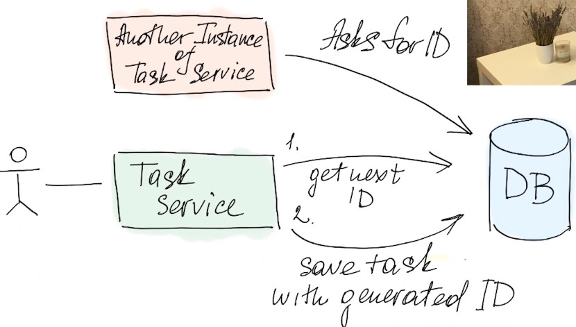

# Lecture 4

## DDD

### DDD - Entity. Что такое сущности

- Entity: is a model that represents a concept in the domain. It has a unique identity and it is not defined by its attributes. It is defined by a thread of continuity and its identity.

- Thread of continuity: is a sequence of events that are related to the same entity. It is the history of the entity.

### DDD - Entity identity. Понятие идентичности сущностей

- Entity identity: is a unique identifier that distinguishes one entity from another. It is not the same as the entity's attributes. It is unique and it is not changed over time.

### DDD - Application generated id. Генерация ID на стороне приложения

- UUID - Universally Unique Identifier: is a 128-bit number used to identify information in computer systems. It is a 32-digit hexadecimal number.

### DDD - Persistent mechanism assigns identity. СУБД герерирует ID

- Database generated id: is a unique identifier that is generated by the database. Most likely it is an auto-incrementing integer.

- Not all databases support this feature. For example, MongoDB does not support this feature.

### DDD - Timing of ID generation. Ранняя и поздняя генерация ID

- Early ID generation: is when the ID is generated before the entity is saved to the database. This is the most common approach.

- Late ID generation: is when the ID is generated after the entity is saved to the database. This is the least common approach.

### DDD - Value objects. Объекты значения

- Value object: is a model that represents a concept in the domain. It is defined by its attributes. It does not have a unique identity. It is not defined by a thread of continuity.

- Example of value objects: Address, Email, Phone number, color, etc.

- Extension functions: are functions that extend the functionality of a class without having to inherit from the class or use any type of design pattern such as Decorator.

### DDD - Value objects VS Entity. Разница сущностей и объектов-значений

- Value objects are immutable. They cannot be changed once they are created.

- Value objects are compared by their values. They are equal if their values are equal.

- Value objects are not persisted. They are not saved to the database.

- Value objects are not identified by a unique ID. They are identified by their values.

- Value objects are not updated. They are replaced.

## DDD - Aggregates. Агрегаты введение.

- Aggregate: is a model that represents a concept in the domain. It is defined by a thread of continuity and a root entity. It is a cluster of associated objects (entities) that can be treated as a single unit.

### DDD - Aggregate as update unit. Агрегат как единика изменения.

### DDD - Invariantats, transactions. Инварианты, агрегаты как транзакционная граница.

- Invariant: is a condition that must always be true. It is a rule that must always be followed.

- Example of invariant: The total amount of money in the bank must always be equal to the sum of the money in all the bank accounts.

- Aggregate as transaction boundary: is the idea that the aggregate is the transaction boundary. All the changes to the aggregate must be done in a single transaction.

- Atomicity: is the idea that the aggregate is an atomic unit. All the changes to the aggregate must be done in a single transaction. If the transaction fails, all the changes are rolled back. If the transaction succeeds, all the changes are committed. The aggregate is either fully updated or not updated at all. There is no partial update. This is the idea of atomicity.

### DDD - Aggregates implementation example. Реализация агрегата с атомарными операциями..

- All operations on aggregates must be atomic.

- Aggregates can be realized as a whole.

### DDD - Transaction isolation. Изоляция транзакций и уровни изоляции..

- What happens when two users edit the same aggregate at the same time?

- ACID: is a set of properties that guarantee that database transactions are processed reliably. ACID stands for Atomicity, Consistency, Isolation, and Durability.

- The higher the isolation level, the more reliable the transaction processing. But the more resources it consumes.

- Isolation levels: Read uncommitted, Read committed, Repeatable read, Serializable.

- Dirty read: is when a transaction reads data that has not been committed by another transaction.

### DDD - Isolation with optimistic locking. Оптимистичные блокировки..

- Optimistic locking: is a mechanism that allows concurrent access to data. It is based on the idea that the data is usually not modified. So, if the data is not modified, the transaction can be committed. If the data is modified, the transaction must be rolled back and retried.

### DDD - Можно ли реализовать агрегат с помощью другой СУБД

- Yes, you can implement aggregates with other databases. But you will have to implement the same concepts. For example, you will have to implement the same isolation levels. You will have to implement the same atomic operations. You will have to implement the same transaction boundaries. You will have to implement the same invariants... etc.

### DDD - Size matters. Почему мы не хотим делать агрегаты слишком большими?

- The bigger the aggregate, the more complex it is. The more complex it is, the more difficult it is to understand. The more difficult it is to understand, the more difficult it is to maintain. The more difficult it is to maintain, the more difficult it is to change. The more difficult it is to change, the more difficult it is to evolve. The more difficult it is to evolve, the more difficult it is to adapt to the changing business needs.

- Performance-wise it is better to have smaller aggregates. The smaller the aggregate, the less data it has to load. The less data it has to load, the faster it loads. The faster it loads, the faster it responds. The faster it responds, the better the user experience.

### DDD - Вопросы формирования агрегата и выбора его размера

- How do you decide what to put in an aggregate?

- How do we decide how to divide the aggregate?

### DDD - Strict and eventual consistency. Виды согласованности - строгая и конечная..

- Strict consistency: is when all the nodes in the cluster have the same data. It is the most reliable consistency model. But it is the most expensive one. It is the most expensive one because it requires a lot of communication between the nodes, and it requires a lot of synchronization between the nodes, and it requires a lot of locking between the nodes.

- Eventual consistency: is when the nodes in the cluster eventually have the same data. It is the least reliable consistency model. But it is the least expensive one. It is the least expensive one because it requires very little communication between the nodes, very little synchronization between the nodes, and very little locking between the nodes.

### DDD - Aggregates forming. Выбираем размеры наших агрегатов.

- How do we decide the size of the aggregate?
    - The size of the aggregate depends on the business requirements.
    - Try to make the aggregate as small as possible.

