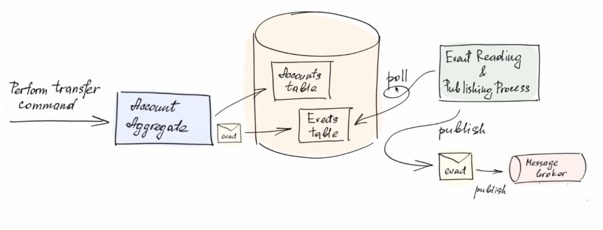

# Lecture 5

## Event Sourcing

### Commands 
- Command: Is a request to change the state/something in the system. What they do occasionally:
    - Update operation / write operation 
    - Validates its arguments
    - Inforces the invariants, confirms the the invriants are not violated and continues to execute the command

### Events

- Events: A data structure that tells that something happen in the system. It doesn't change anything, it itself is the fact that something changed.

    - Update fact 
    - Carrying the change details 
    - Has it's own meaningful name 
    - The source of communication and consistency

- Responsible for eventual consistency

- Commands change the Aggregates, which results in events.
- Aggregates in one bounded context can listen to events from within the same bounded context directly.
- Bank with id 10 can listen to events from bank with id 15, from the same aggregate type.

- Command may result in generating n number of events. Example: When a bank account is created, it generates 2 events: AccountCreated and AccountActivated.

### DDD + EDA

- We have 2 actions (Update the database and Create event), it's a problem if one of them fails. We need to make sure that both of them are successful. What do we do?

### Atomic Event Publishing

- This is what we do: 2 Tables in DB one for the aggregate, second for the event. And we create a background process that will check which events are not yet published and publish them to the message broker. After publishing the event, we update the event table to mark it as published.

#### Transactional Outbox Pattern

- What if the database is not relational and no transactions?
    - We include the event publishing in the same transaction as the aggregate update. We can do this by using a transactional outbox pattern.

- We should have a guaranteed atomicity of the event publishing and the aggregate update in one transaction.

### Event ordering preservation

- Another problem is that we may receive events in a different order than they were published. We need to make sure that the events are published in the same order as they were created.
    - Solution is the same as the previous one, we use a transactional outbox pattern.

- Every event receiver should be idempotent. It should be able to handle the same event thats received multiple times (Event doubling).

### Event Sourcing

- Event sourcing suggest that we should store the events instead of the aggregate itself. We can do this by storing the events in a database.

- We take from the database just a pack of the events that belong to the aggregate with the given id. We apply the events to the aggregate and we get the latest state of the aggregate (Or any state that we want).

### Event Sourcing benefits

- Audit logging / Investigations 
- Customer support 
- Troubleshootings 
- Analytics, metrics, getting insights

### Event Sourcing drawbacks

- It's hard to implement (May not worth it for small apps). Worth it only when the business can benefit from it.