# Lecture 6

## Event Sourcing

### What should we do with all these events?

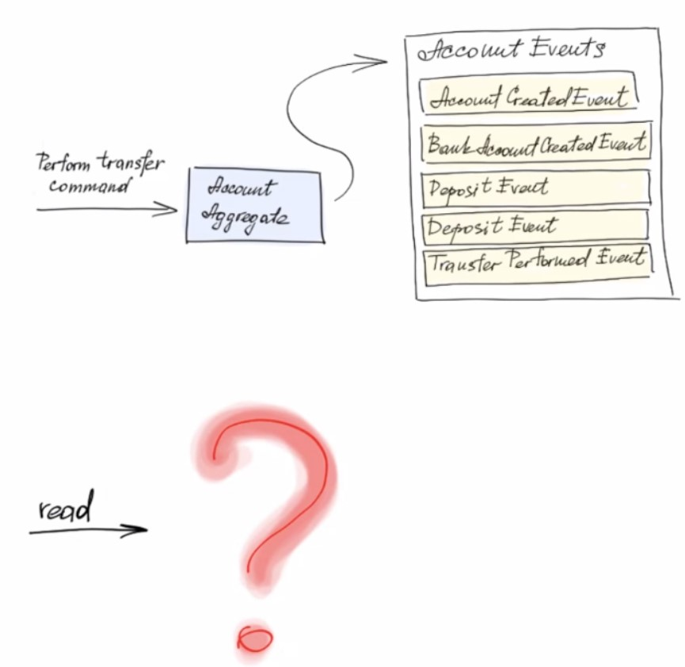

### Reading the aggregate

- Event sourcing technique is not intended for 
querying objects at all. We will look at CQRS 
pattern which is used for this purpose 
- We need state recreation for ***updates***

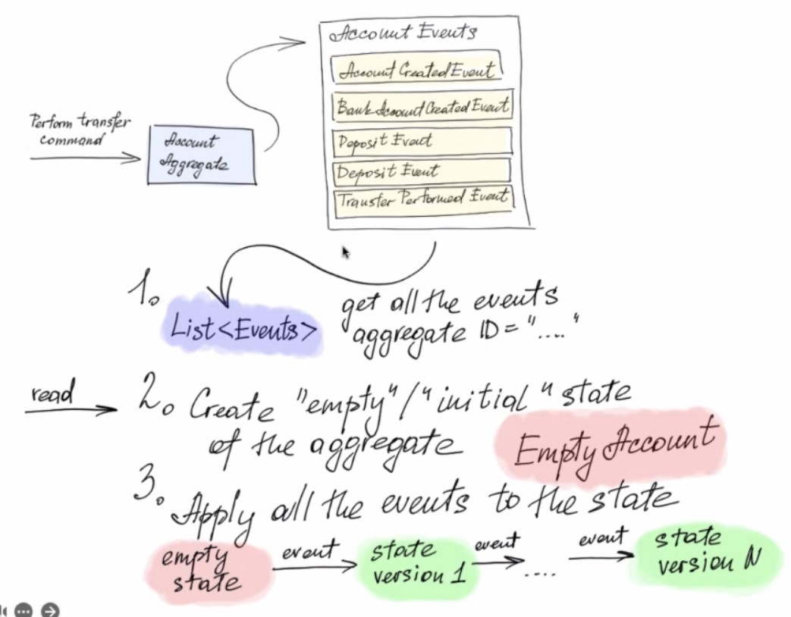

### Comparing with git branches

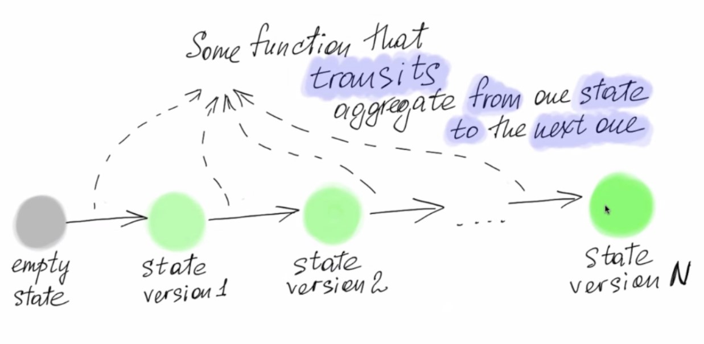

### Aggregate state

- ***Aggregate*** — cluster of entities and value objects 
- ***Aggregate State*** — the state of the cluster at some point of time. The Projection of an aggregate.

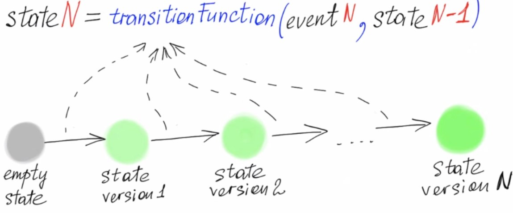

### Terminology

- ***State*** — the projection of an aggregate data at some 
point of time. State includes the data needed for 
checking the invariants 
- ***Command*** — function that takes some state and 
checks if the update is possible (checks the invariants, 
performing the validations). If it is — creates the 
corresponding event 
- ***Transition function*** — mutate the state according to 
passed event moving it forward to the next state 

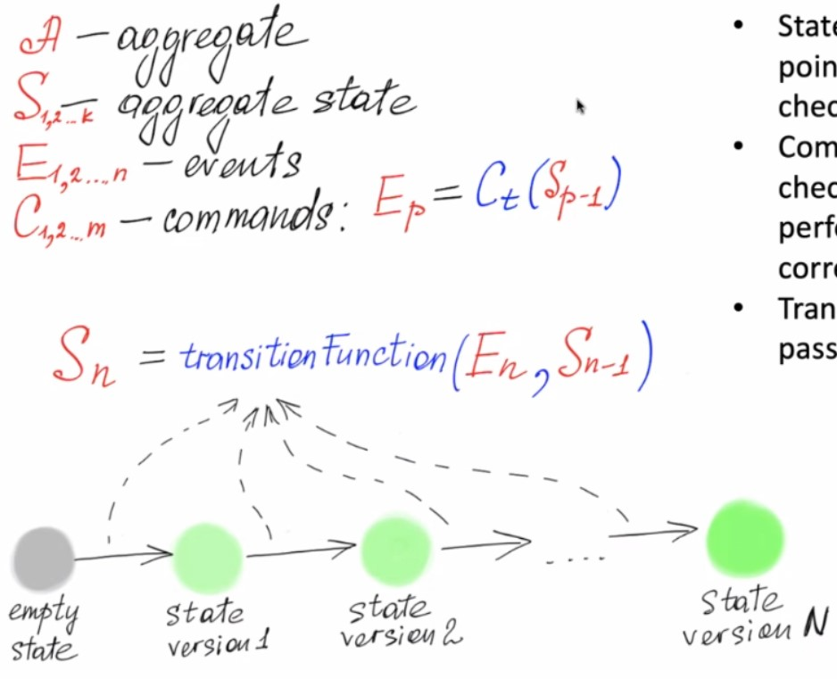

### Aggregate update process

1. Fetch all the aggregate events (with given ID) 
2. Create empty state 
3. Apply transition function sequentially to all 
events 
4. Perform command to the most actual state 
5. Save resulted event to the event store 

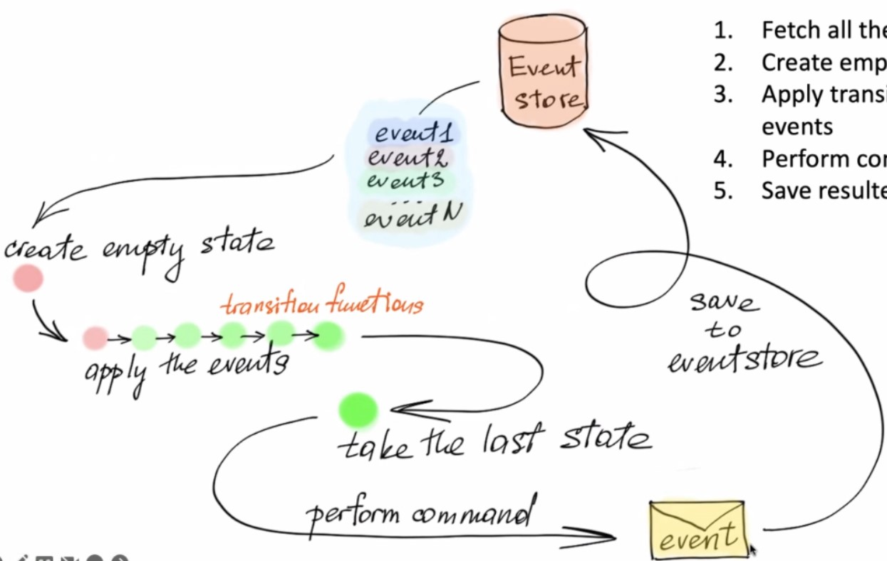

### Concurrent aggregate instance update

- Using optimistic lock technique 
- Getting the monotonically increasing counter 
over an aggregate instance (version)

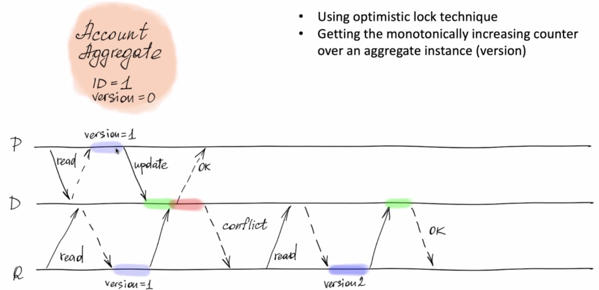

### Replicated state machine (RSM)

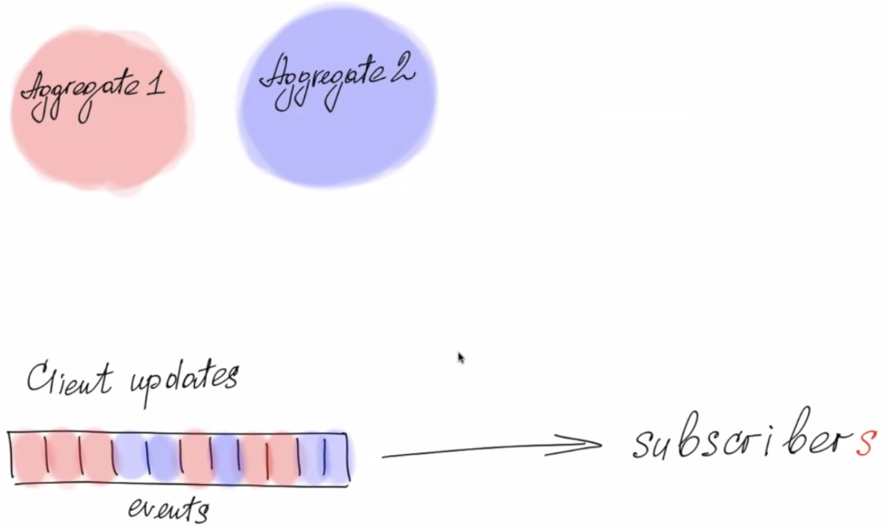

- Want to get **total order** over the aggregate 
instance (and aggregate type probably) 

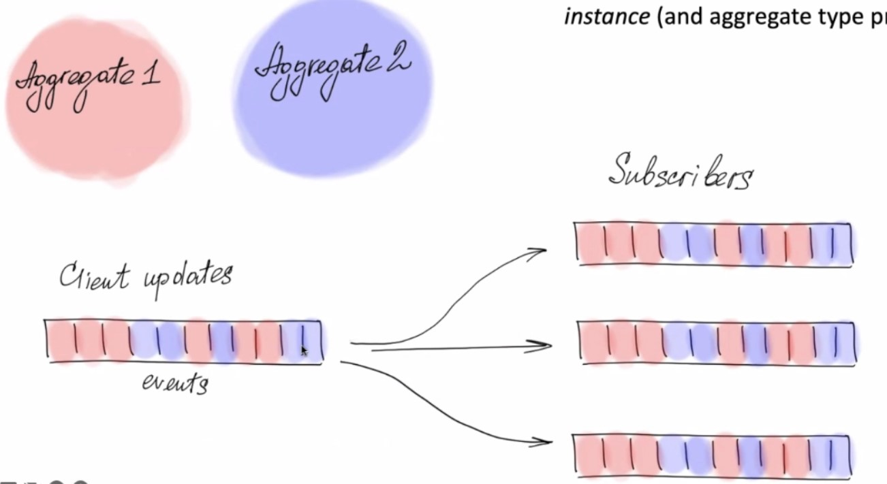

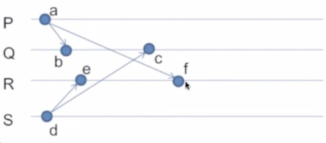

The problem is we have a lot of clients (nodes) that always change their aggregate.

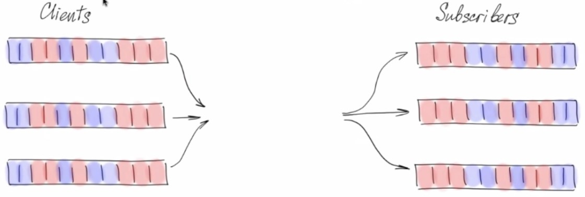

The solution is we create a central server (Whether it's a message broker or a database) that will be responsible for the total order (The order of the events).

- Centralized server (DB, Message Broker) 
- Globally numbering the events for reading 
processes 
- ***FIFO order*** for consuming processes 

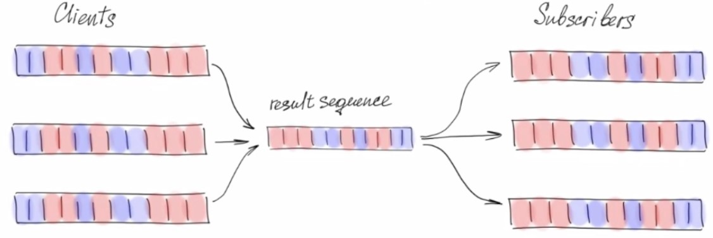

### Projections / Views / Replicas

- Derived data structures based on aggregate events 
- Might be denormalized for the sake read speed 
- Might always be reproduced from scratch by 
"replaying" the events 
- Increasing reliability via the data duplication

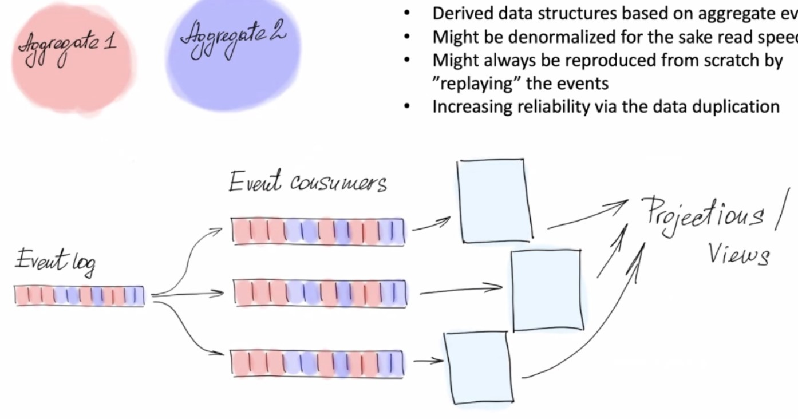

***Benefits:***
- Increased reliability of the system (If the event sourcing service is down, we can still read the data from the projections, because the data is located in another service)
- Losing the view is not a problem (If we lose the view, we can always recreate it from the events)