# Lecture 7

## Event Sourcing

### Distributed money transfer task

- Transfer some amount of money from source to destination bank account 
- All the accounts and Transaction initiator (user) might be served by different machines in different 
DCs 
- System should be eventually consistent. The transfer should be atomic

### Transfer 
- Transaction, Accounts — aggregate instances. Considering the to be distributed hosts 
- Transactions aggregate object tracks the progress, coordinates the process by firing the events 
and aggregating the results.

- Accounts listen to the events, when the event corresponds to them, they start the process of checking if they're able to perform the transfer and if so, they return OK event. If not, they return the error event.

- When transaction receives all the OK events, it fires the transfer commit event.

- The accounts send the transfer OK event.

- All arrows are events.

- Between Transaction and accounts there is a message broker.

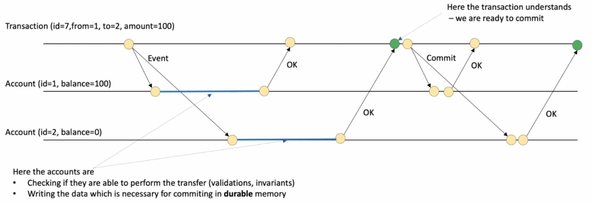

- All information for the rollback is stored in durable memory.

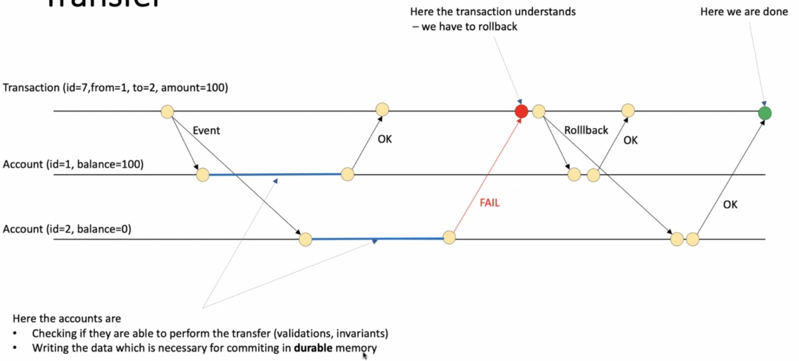

### Atomicity 
- Both succeeded or neither (both rollbacked) 
- How can we implement rollback 
    - Does not make changes visible but store information for or for applying changes (redo log) 
    - Apply changes right away (make them visible for everyone) but store information needed for reverting 
changes (undo log) 

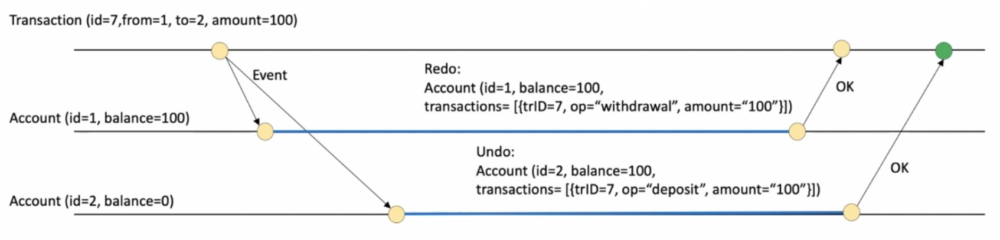

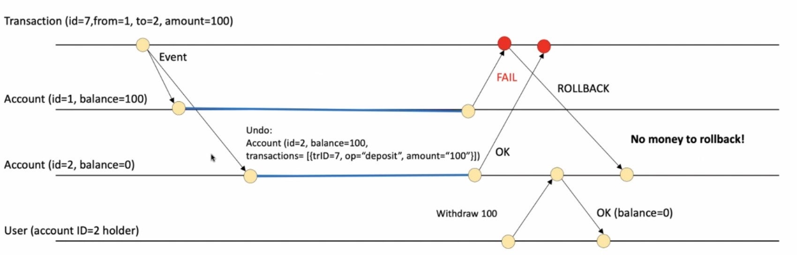

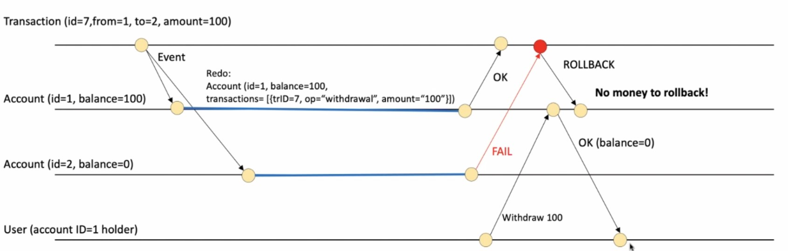

### Isolation 
- Remember PIRTY READ? 
- Undo approach allows dirty read..

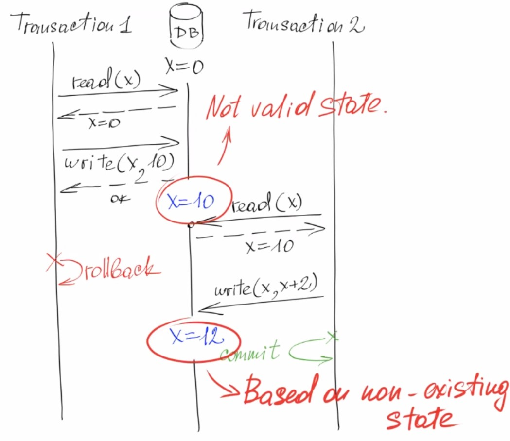

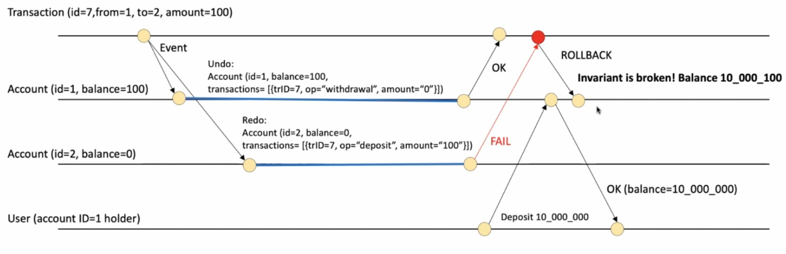

- Remember LOST UPDATE? 
- Things easier with commutative operations 
- Otherwise we can try something like MVCC 
- MVCC — Multi Version Concurrency Control

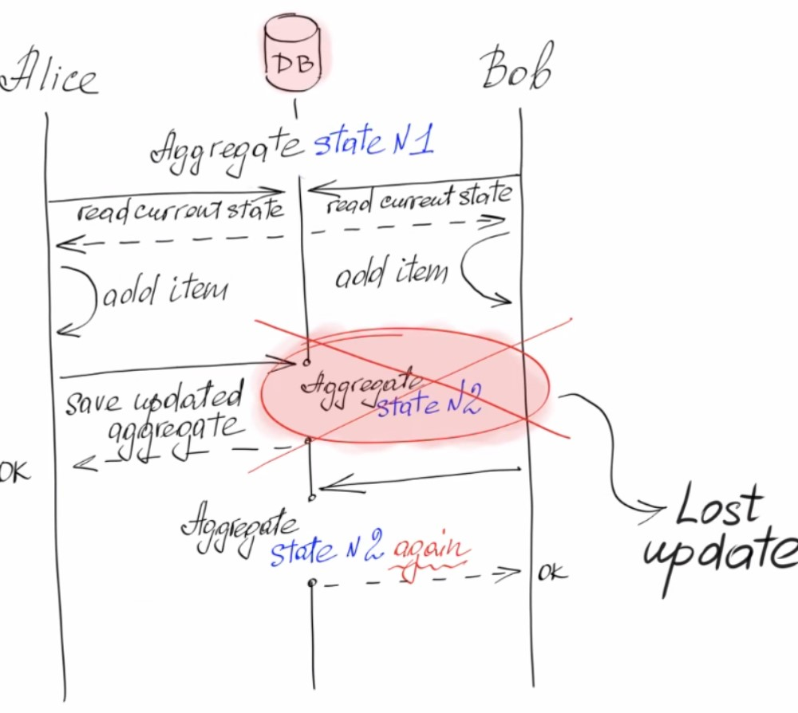

### Transaction State Machine

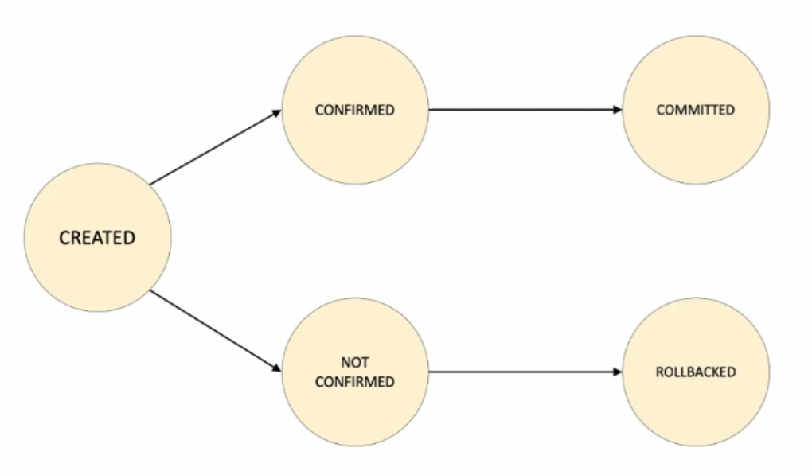

### Consensus 
- All the remote hosts are agreed on some single value 
    - Agree on transaction commit 
    - The order of something (state machine replication) 
- 2PC (two-phase commit) protocol 
    - The commit-request phase - coordinator process attempts to prepare all the 
transaction's participating processes for the commit. 
    - Commit phase - coordinator decides whether to commit or rollback the 
transaction 

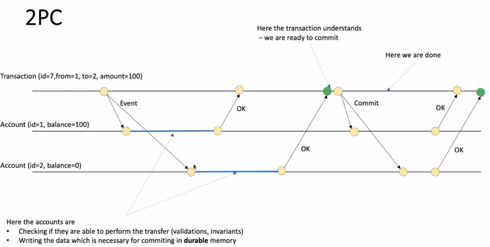

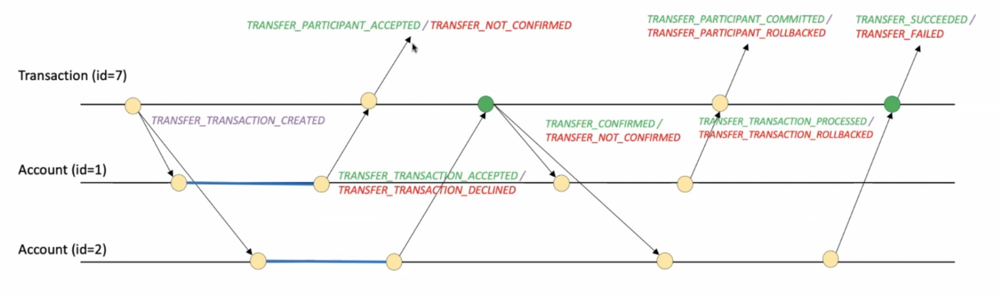