# Lecture 8

## Event Sourcing

### Event Store

### Aggregate update again

- Which type of operations our Event Store should support?

### Simple event store 
- Load all the events for some aggregate instance 
Fetch all by aggregate ID 
- Save new event(s) for some aggregate instance 
    - Throw exception if event with given version 
already exists 
- ***Never remove event***

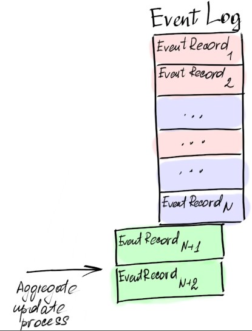

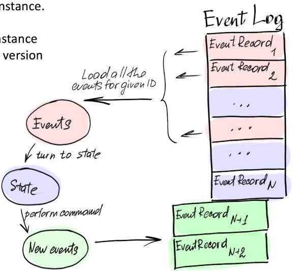

### Event records

- Events have arbitrary structure

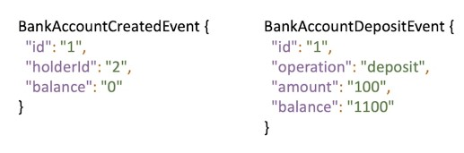

- Serialize event to json/xml string, or byte array 
- Add attribute that will help in deserialization (name, 
class name)

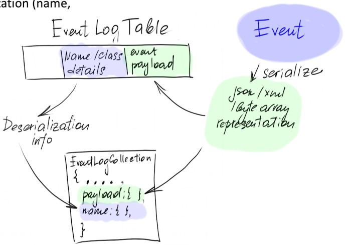

- Event payload (json/xml string, or byte array) 
- Attribute that will help in deserialization (name, class name) 
- ID of the record 
- ***ID of the aggregate instance***
- Version (for optimistic locking) 
- Any metadata (userld, timestamp) 
- Sequence ID (global sequential number within the log)

### Event records - sequence ID

- Each message in log has it's own sequence ID 
- Each reading process (local process/subscriber) consume event in this order 
- Use auto incrementing columns in DB, SERIAL datatypes

- In MongoDB for example, we don't have auto incrementing columns

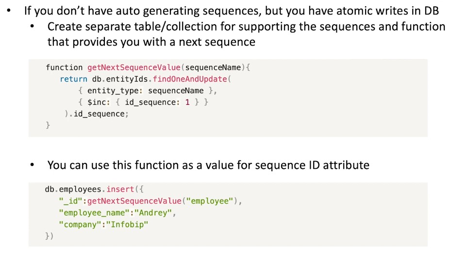

## Projections

### Task manager application

- User registers 
- Users 
    - Can search for other users
    - Create projects 
       - Invites other users to become a members of the projects 
       - Creates tasks within a project 
       - Assigns the members of the project to the tasks 
       - Edit tasks (names, description, status, assignees) 
       - Comments on tasks

### Language, aggregates and entities

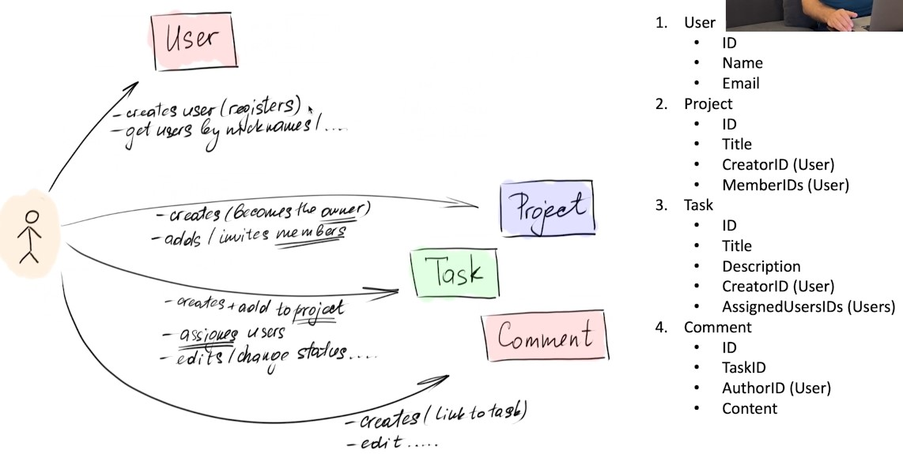

### Bounded contexts

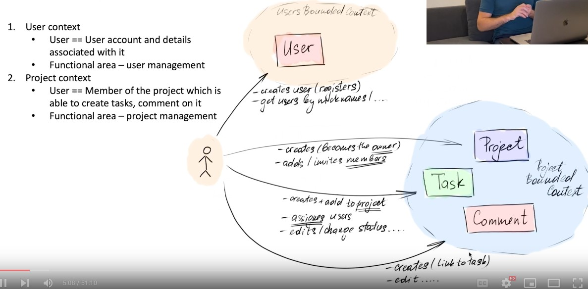

### Commands

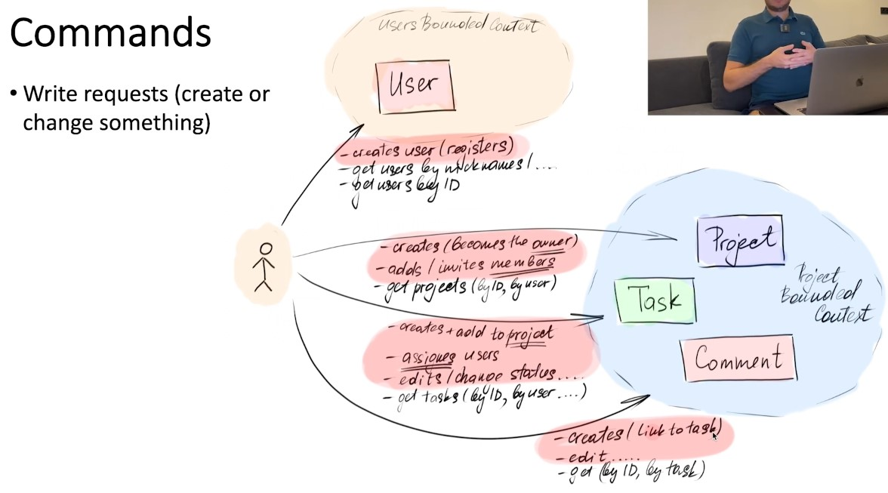

### Queries

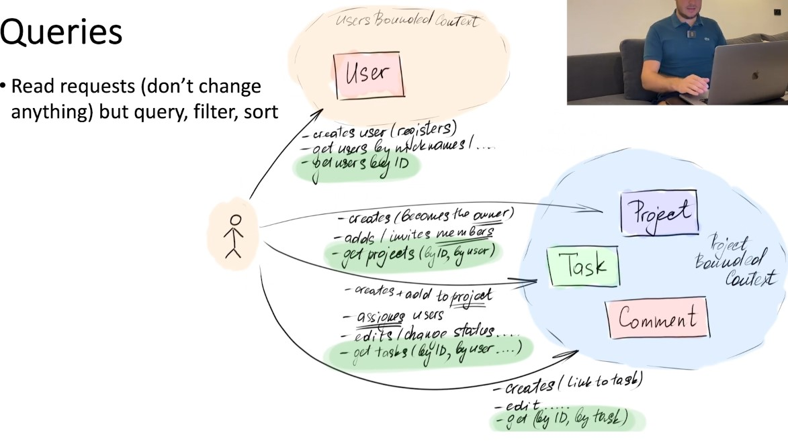

### Querying event store

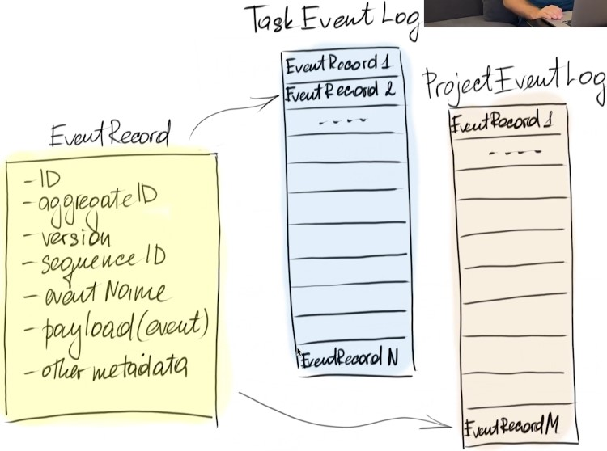

1. Select all events of "appropriate" type from 
event log. Say, find all **TaskUserAssinged** events 
2. Search on internal event structure (possibly 
deserialize it first), filter only events with given 
userld 
3. Obtain tasklDs and get all the tasks (get the 
whole aggregate states) 
4. Remember that we have **TaskUserUnassinged**
events and take this into consideration...

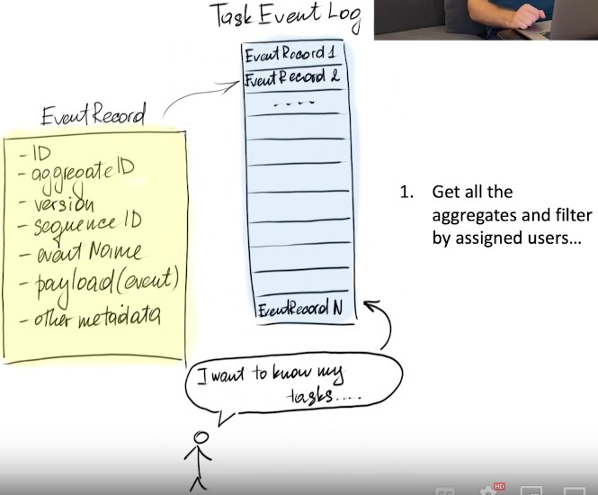

- ***Querying the event store is not an option!***

### CQRS - Command Query Responsibility Segregation

- Different components are responsible 
for handling command and query 
requests 
- Different and the most efficient and 
optimized for a particular cases **data models** and **data stores** are used for 
commands and queries and even for 
different cases of queries 
- Queries are served by 
**projections/views** which are formed 
by the subscribers of the events and 
based on the events 

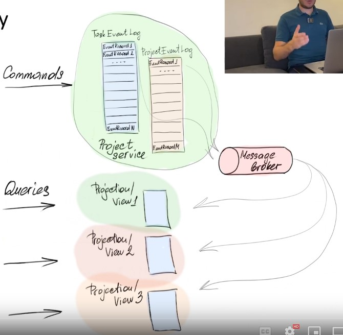

### Projections / Views / Replicas

- Format optimized for reader's needs 
- Data models, structures and DBMS tools 
optimized for better performance of the 
particular structures (denormalizations, indexes, 
type of DBMS etc.) 
- Each projection can support different types of 
queries 
- Projections can be used as a cache to get rid of 
unnecessary communication, for performing 
quick validations and checks 
- They increase the reliability of the system 
- They can be rebuilt by replaying the same event 
stream 

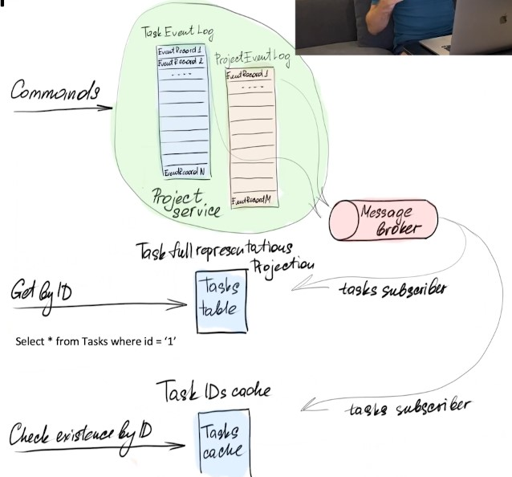

- Data duplication, cost of keeping the 
consistency and rick of inconsistency 
- Difficulties in building the projections correctly, 
high entry threshold 

### User projection

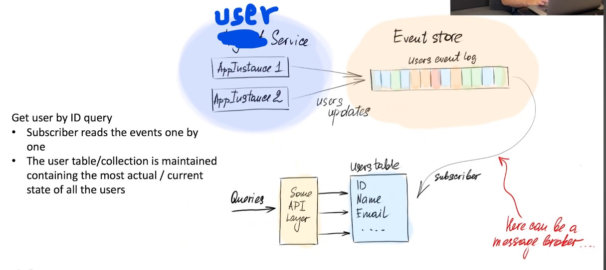

### Project projection

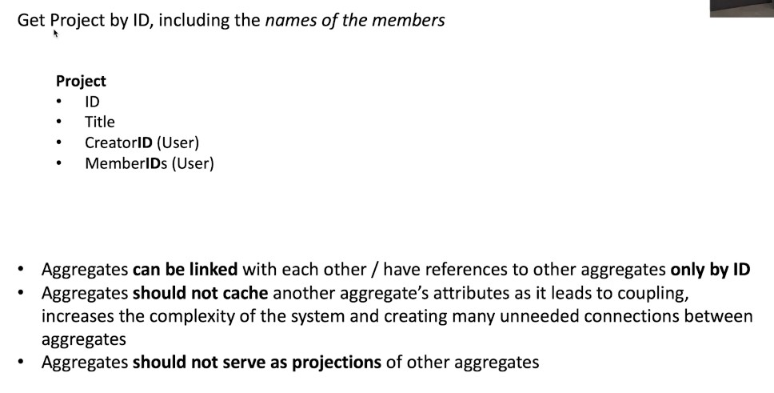

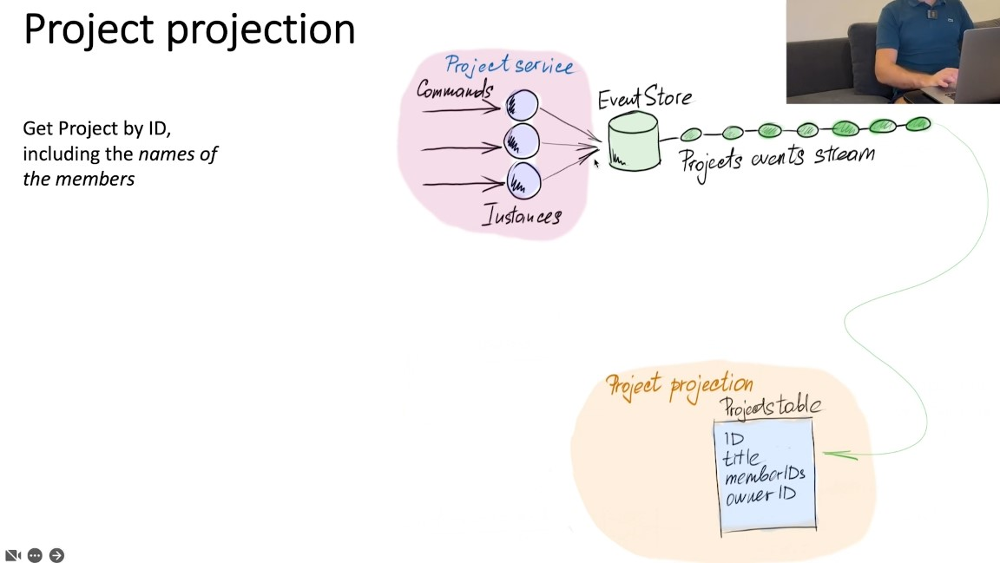

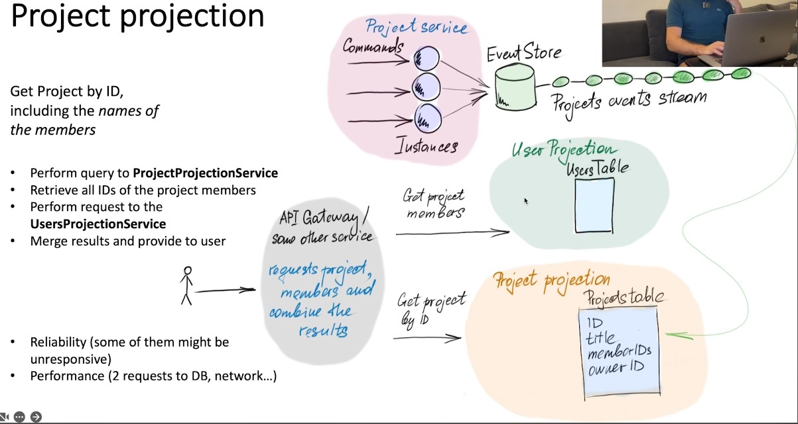

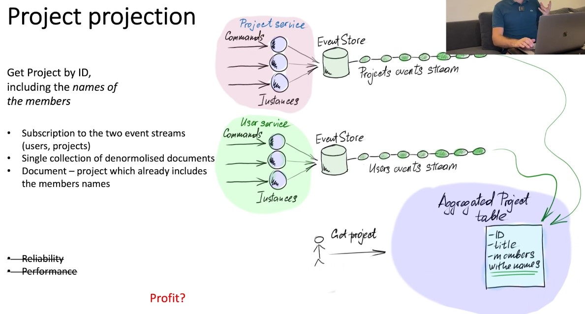

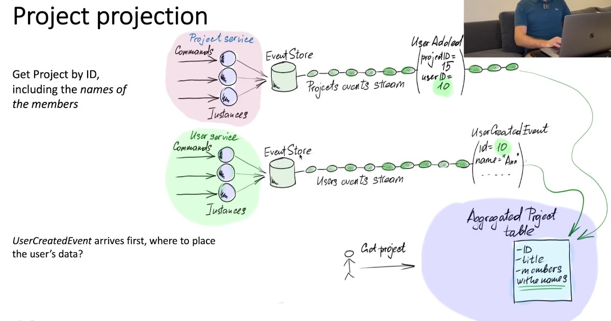

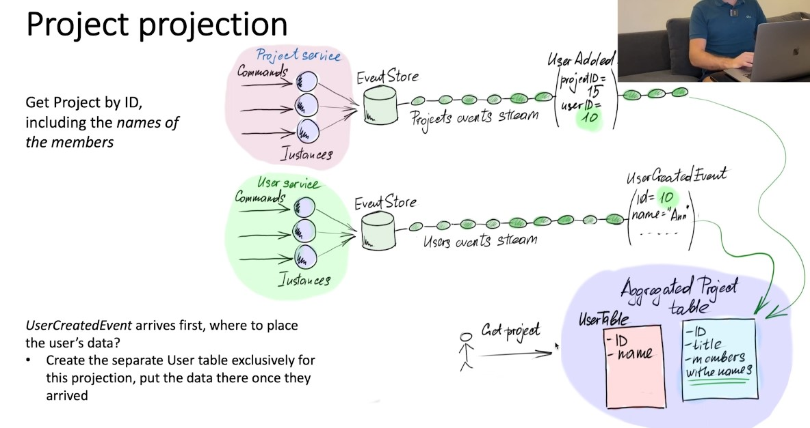

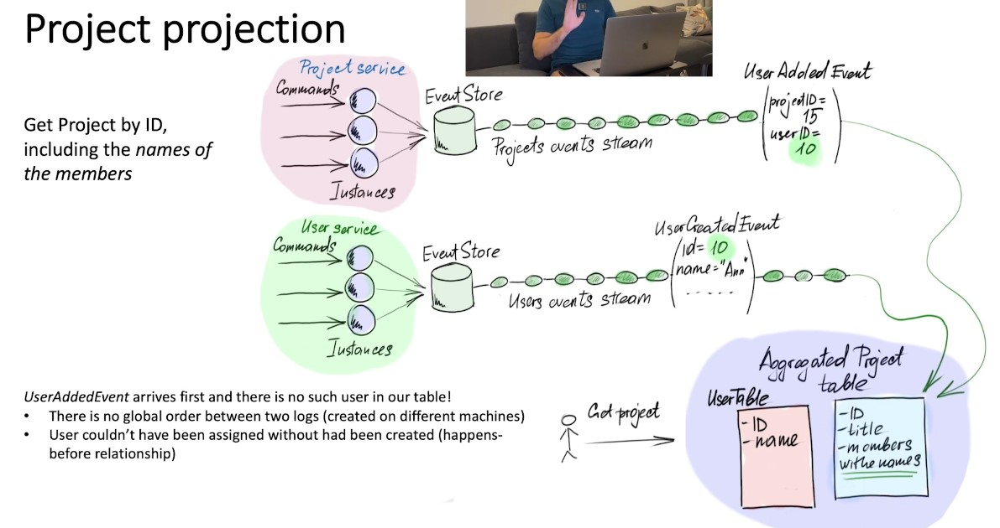

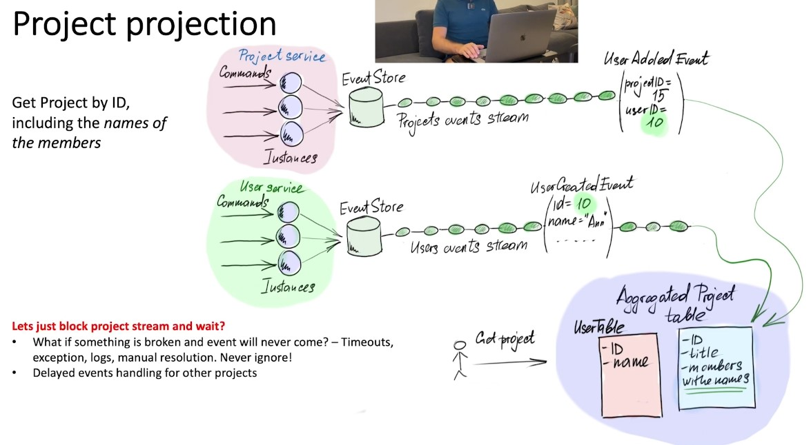

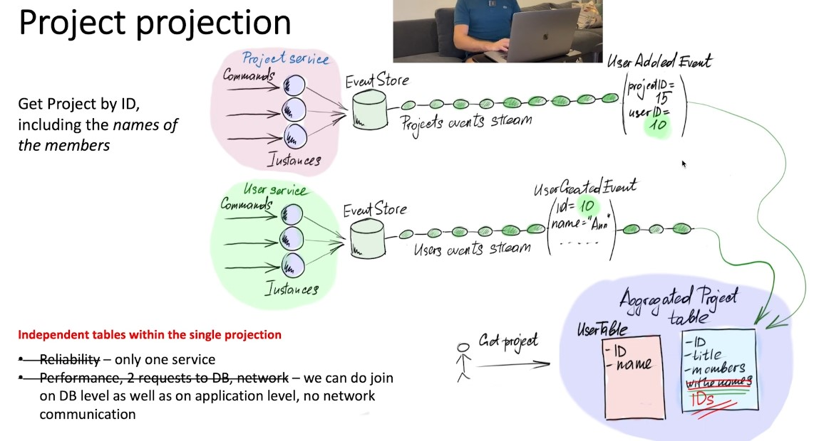