# Lecture 9

## Event Sourcing

## Event Streams

### Inventing the Kafka

### Event Stream

- Event sequence produced by some aggregate type / bounded context / application

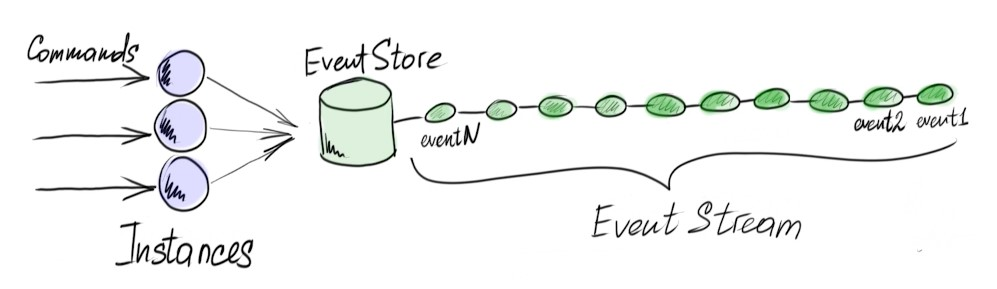

### Event stream multiplexing

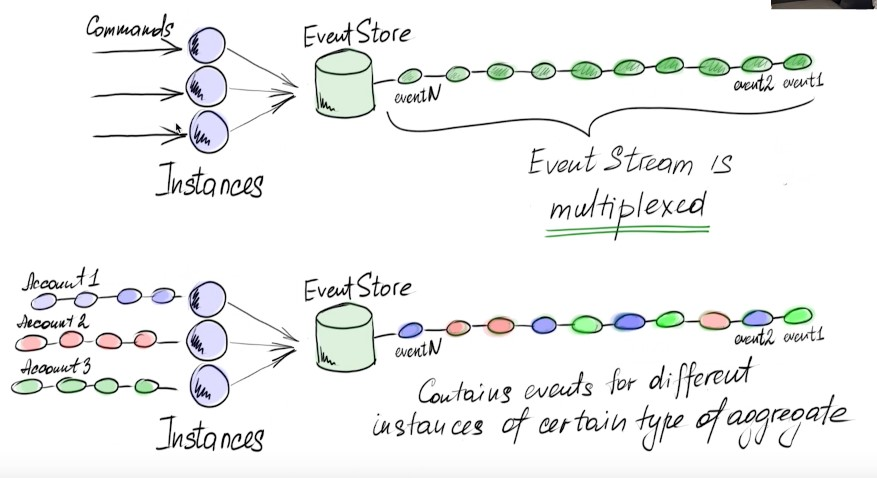

### Event stream subscribers

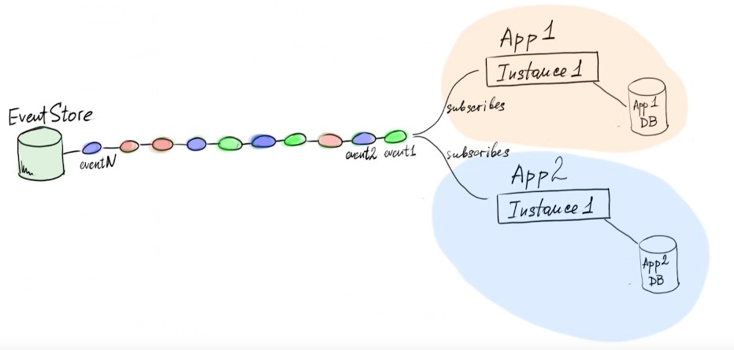

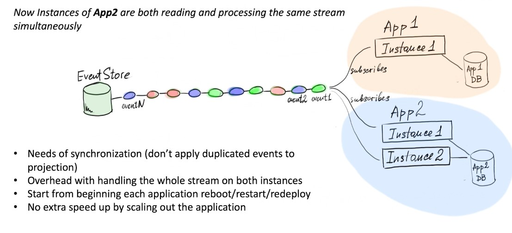

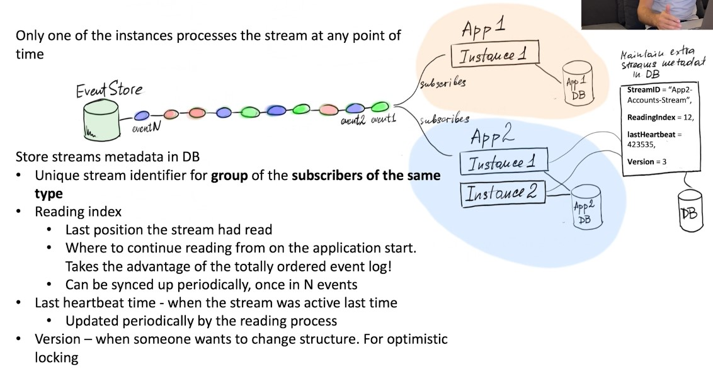

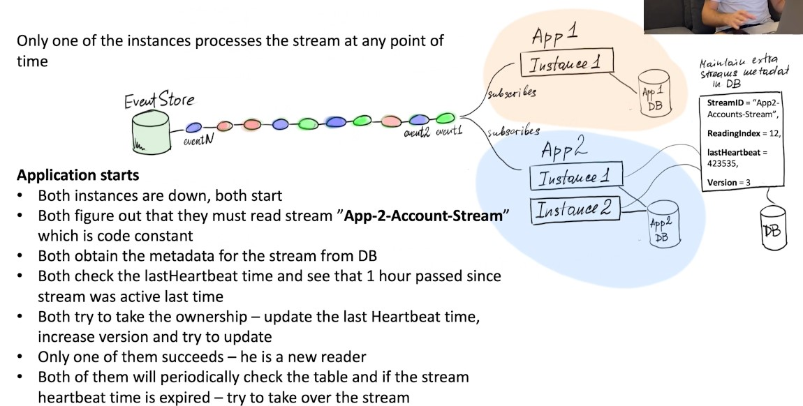

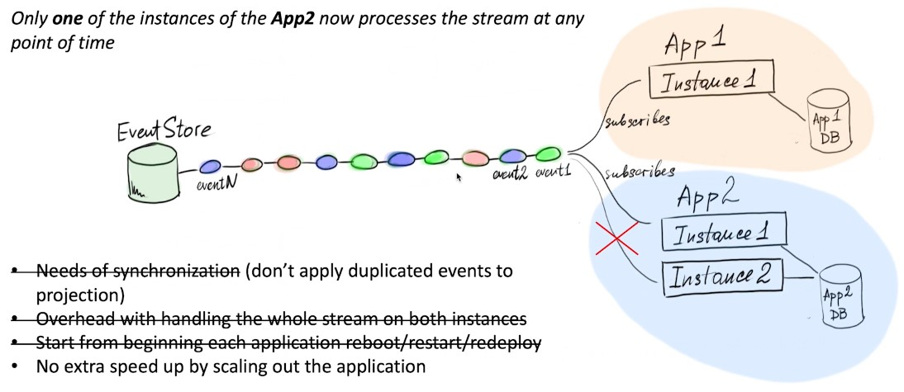

### Event log partitions / shards

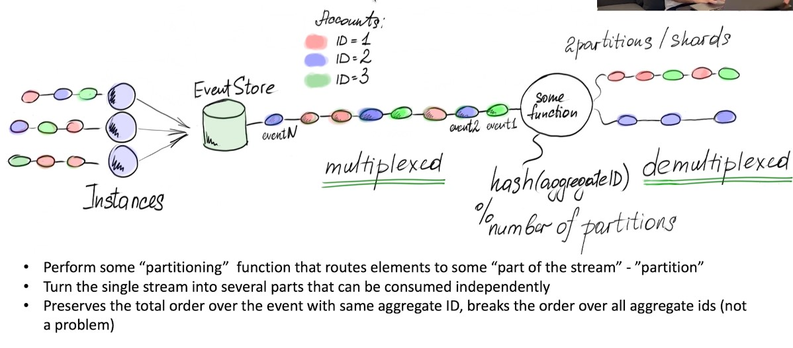

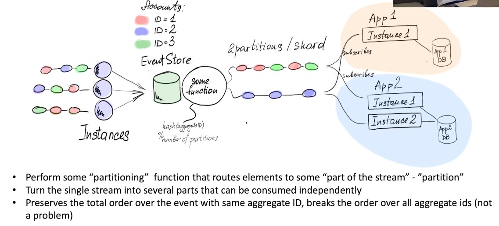

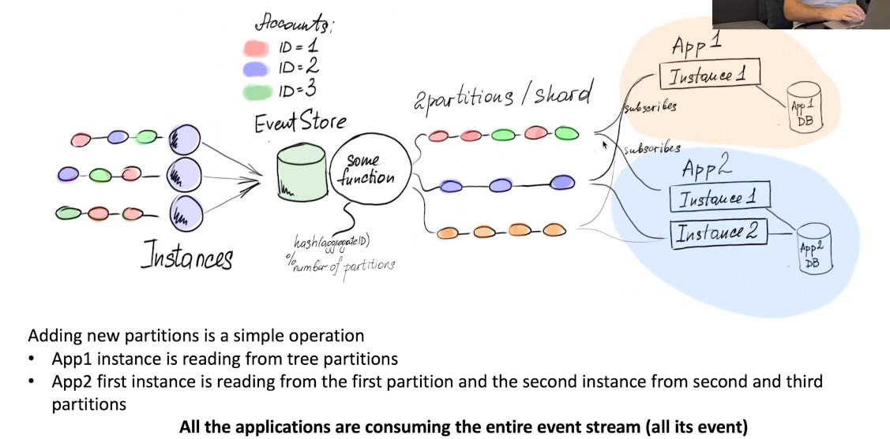

### Event log offsets

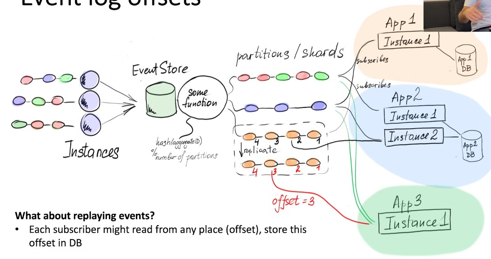

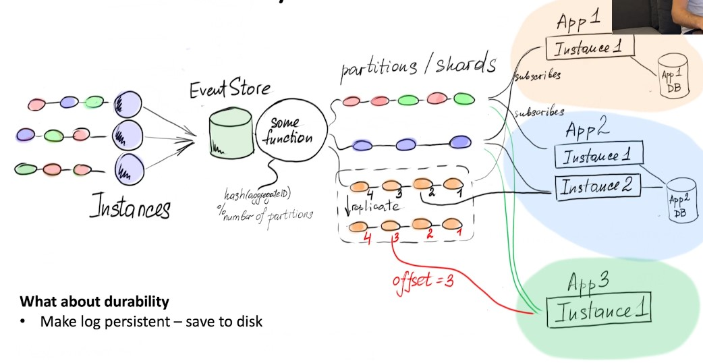

### Kafka - align the terminology

### Kafka

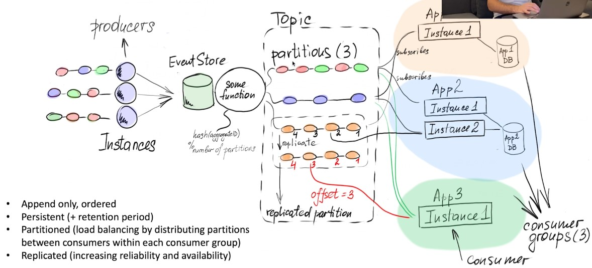