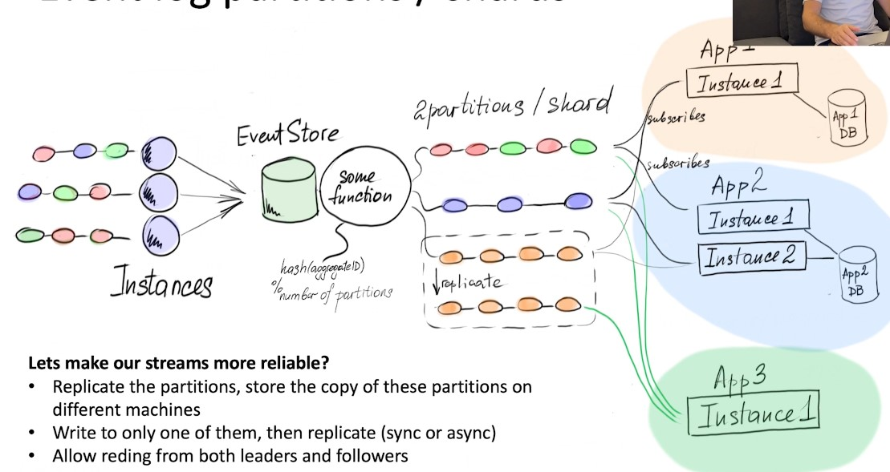
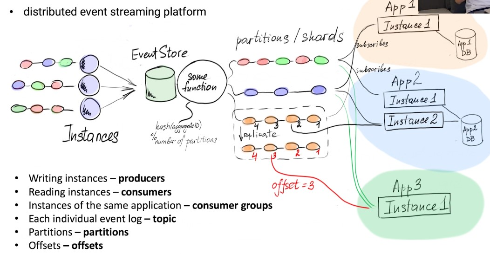

# Lecture 9

## Event Sourcing

## Event Streams

### Inventing the Kafka

### Event Stream

- Event sequence produced by some aggregate type / bounded context / application

### Event stream multiplexing

### Event stream subscribers

### Event log partitions / shards

### Event log offsets

### Kafka - align the terminology

### Kafka

